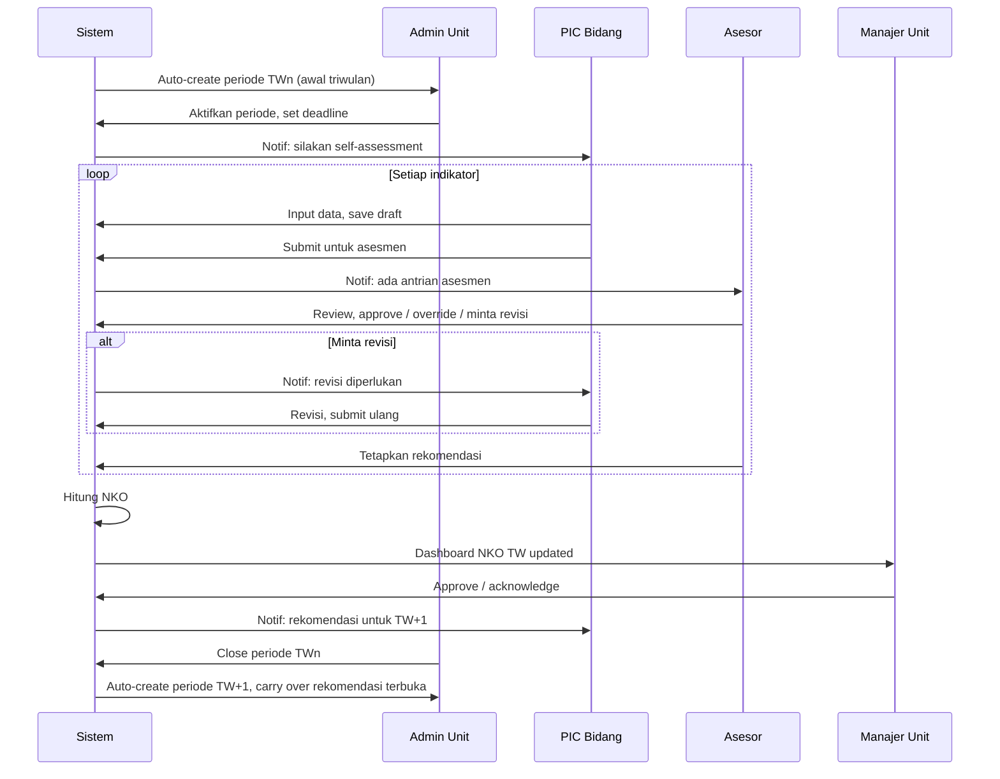

# 02 — Functional Specification

> Spesifikasi modul fungsional, user roles, dan alur kerja SISKONKIN.

---

## 1. User Roles

| Role | Deskripsi | Akses Utama |
|------|-----------|-------------|
| **Super Admin** | Tim CV Panda Global Teknologi (developer/maintainer) | Master data, konfigurasi, audit log, semua fitur |
| **Admin Unit** | Manager Kinerja PLTU Tenayan / DIVPKP perwakilan | Konfigurasi periode, assign asesor, manage user unit |
| **PIC Bidang (Asesi)** | Pegawai bidang yang memiliki indikator (BID OM, REL, HSE, dst) | Self-assessment indikator yang menjadi tanggung jawab bidangnya |
| **Asesor** | Penilai (DIVPKP / Bidang Pembina dari Kantor Pusat / Internal) | Verifikasi self-assessment, beri nilai final, beri rekomendasi |
| **Manajer Unit** | Manager / GM PLTU Tenayan | View semua, approve final NKO, dashboard eksekutif |
| **Viewer** | Read-only stakeholder | Dashboard view, laporan, tanpa edit |

### Mapping Indikator ke Bidang
Setiap indikator di-link ke satu atau lebih `bidang_id` (master data). PIC dari bidang itu otomatis bisa mengakses indikator tersebut. Multi-bidang dimungkinkan untuk indikator agregat (mis. EAF/EFOR diakses BID OM-1 s/d OM-RE).

---

## 2. Modul Fungsional

```
SISKONKIN
├── A. Master Data Module          (Super Admin / Admin Unit)
├── B. Periode Management           (Admin Unit)
├── C. Self-Assessment Workspace   (PIC Bidang)
├── D. Asesor Workspace             (Asesor)
├── E. Recommendation & Action Tracker  (PIC + Asesor + Manajer)
├── F. NKO Calculator & Aggregator (Auto/Sistem)
├── G. Dashboard & Analytics       (Semua role)
├── H. Compliance Tracker          (BID CPF + PIC laporan)
├── I. Reports & Export            (Semua role)
├── J. AI Assistant                (Semua role, opt-in)
└── K. Audit Log                   (Super Admin / Auditor)
```

---

## 3. Modul A — Master Data

### Entitas Master:
- **Konkin Template Tahun N** — struktur perspektif, indikator, bobot per tahun
- **Stream Maturity Level** — definisi setiap stream (Outage, Reliability, dst), area, sub-area, kriteria level 0–5
- **Bidang** — master bidang & sub-bidang
- **User** — pegawai, role, bidang
- **Pemilik Proses** — mapping indikator ↔ bidang
- **Master Konstanta** — DMN per mesin, target RKAU per komponen, dst

### Fitur:
- CRUD struktur Konkin per tahun (clone dari tahun sebelumnya, lalu edit)
- Import struktur dari Excel (kertas kerja existing) sebagai bootstrap
- Dynamic schema untuk maturity level: setiap stream punya struktur area/sub-area sendiri
- Validasi konsistensi (bobot total perspektif = 100, bobot sub-indikator agregat = 100%, dll)

### Dynamic Schema untuk Maturity Level

Karena setiap stream berbeda struktur dan kriteria, kita pakai **JSONB schema** di PostgreSQL:

```jsonc
{
  "stream_id": "outage_management",
  "stream_name": "Outage Management",
  "weight_ml": 50,
  "weight_kpi": 50,
  "areas": [
    {
      "code": "I1.1",
      "name": "Long Term Planning",
      "sub_areas": [
        {
          "code": "I1.1.1",
          "name": "Rencana dan Jadwal Planned Outage Jangka Panjang",
          "uraian": "Terdapat rencana dan jadwal Planned Outage...",
          "criteria": {
            "level_0": "≤1: [deskripsi level fire fighting]",
            "level_1": "1<x≤2: [deskripsi level stabilizing]",
            "level_2": "2<x≤3: [deskripsi level preventing]",
            "level_3": "3<x≤4: [deskripsi level optimizing]",
            "level_4": "4<x≤5: [deskripsi level excellence]"
          }
        }
      ]
    }
  ]
}
```

---

## 4. Modul B — Periode Management

**Konsep periode:**
- Konkin formal: **Semester 1, Semester 2** (per tahun)
- Monitoring internal SISKONKIN: **TW1, TW2, TW3, TW4** (lebih granular)
- Mapping: TW1+TW2 → S1, TW3+TW4 → S2

### Fitur:
- Buat periode baru (otomatis Q1 di awal tahun)
- Status periode: `Draft` → `Aktif` → `Self-Assessment` → `Asesmen` → `Final` → `Closed`
- Lock periode lama saat sudah closed (data jadi read-only kecuali Super Admin)
- Setting deadline per fase (PIC submit, asesor review, finalisasi)
- Notification scheduler (email/in-app) menjelang deadline

---

## 5. Modul C — Self-Assessment Workspace (PIC Bidang)

**Tampilan utama:** dashboard pribadi yang menampilkan **hanya indikator yang di-assign ke bidang user**.

### Layout:
```
┌─────────────────────────────────────────────────────────────┐
│ Selamat datang, [Nama PIC] — Bidang [BID OM-3]              │
│ Periode aktif: TW2 2026 (deadline submit: 5 Juli 2026)      │
├─────────────────────────────────────────────────────────────┤
│ Indikator Anda (5)                                          │
│ ┌────────────────────────────────────────────────────────┐  │
│ │ ● EAF (Equivalent Availability Factor)                 │  │
│ │   Status: Belum Disubmit  |  Deadline: 5 Juli          │  │
│ │   [Lakukan Self-Assessment →]                          │  │
│ ├────────────────────────────────────────────────────────┤  │
│ │ ● Outage Management — Maturity Level                   │  │
│ │   Status: Draft (50% terisi)  |  Deadline: 5 Juli      │  │
│ │   [Lanjutkan Self-Assessment →]                        │  │
│ └────────────────────────────────────────────────────────┘  │
└─────────────────────────────────────────────────────────────┘
```

### Form Self-Assessment per Tipe Indikator

#### 5.1 Form untuk KPI Kuantitatif

```
┌─────────────────────────────────────────────────┐
│ Indikator: EAF                                  │
│ Periode: TW2 2026 | Bobot: 6.00 | Polaritas: + │
│ Formula: Σ(AH-EPDH-EMDH-EFDH)×DMN×100/Σ(PH×DMN)│
├─────────────────────────────────────────────────┤
│ Komponen Perhitungan:                           │
│   AH (Available Hours)         [_______] jam    │
│   EPDH (Equivalent PDH)        [_______] jam    │
│   EMDH (Equivalent MDH)        [_______] jam    │
│   EFDH (Equivalent FDH)        [_______] jam    │
│   DMN per mesin (auto-fetch)   [80 MW]         │
│   PH (Period Hours)            [auto: 2160]     │
│                                                 │
│ ─── Hasil Perhitungan (auto) ───                │
│   Realisasi: 84.70%                             │
│   Target SM2: 80.27%                            │
│   Pencapaian: 105.51%                           │
│   Nilai (× bobot): 6.33                         │
│                                                 │
│ Catatan/Justifikasi PIC:                        │
│   [_______________________________________]     │
│   [_______________________________________]     │
│                                                 │
│ Link Eviden Eksternal (opsional, URL):          │
│   [https://drive.google.com/...    ]           │
│                                                 │
│ [Simpan Draft]    [Submit untuk Asesmen]        │
└─────────────────────────────────────────────────┘
```

#### 5.2 Form untuk Maturity Level

```
┌──────────────────────────────────────────────────────┐
│ Stream: Outage Management                            │
│ Periode: TW2 2026 | Bobot ML: 50% | Bobot KPI: 50%  │
├──────────────────────────────────────────────────────┤
│ Progress: 8/24 sub-area dinilai                     │
│                                                      │
│ ▼ Area: Long Term Planning                          │
│   ▼ I1.1.1 Rencana dan Jadwal Planned Outage        │
│     Uraian: Terdapat rencana dan jadwal Planned     │
│     Outage beserta tipe Outage dalam Jangka Panjang │
│                                                      │
│     Pilih Level Pencapaian:                         │
│     ○ Level 0 (≤1) — Fire Fighting                  │
│        [text kriteria spesifik level 0]             │
│     ○ Level 1 (1<x≤2) — Stabilizing                 │
│        [text kriteria spesifik level 1]             │
│     ○ Level 2 (2<x≤3) — Preventing                  │
│        [text kriteria spesifik level 2]             │
│     ● Level 3 (3<x≤4) — Optimizing                  │
│        [text kriteria spesifik level 3]             │
│     ○ Level 4 (4<x≤5) — Excellence                  │
│        [text kriteria spesifik level 4]             │
│                                                      │
│     Nilai Numerik Spesifik (3.00 - 4.00):           │
│        [3.50 ▼]  ← slider/input dalam range level   │
│                                                      │
│     Catatan PIC: [____________________________]     │
│     Link Eviden: [____________________________]     │
│                                                      │
│   ▶ I1.1.2 [next sub-area]                          │
│   ...                                                │
│                                                      │
│ ▶ Area: P3 (1 Week Planning)                        │
│ ▶ Area: Pre Outage                                  │
│ ▶ ...                                                │
│                                                      │
│ ─── Komponen KPI Kuantitatif (50% bobot) ───        │
│ [Form input KPI seperti tipe A]                     │
│                                                      │
│ ─── Realisasi Maturity Level (auto) ───             │
│ Rata-rata sub-area: 3.27                            │
│ Komponen ML × 50% + Komponen KPI × 50% = X.XX       │
│                                                      │
│ [Simpan Draft]    [Submit untuk Asesmen]            │
└──────────────────────────────────────────────────────┘
```

### Aksi PIC:
- `Save Draft` — simpan progress, bisa dilanjutkan
- `Submit for Assessment` — kunci self-assessment, kirim ke asesor
- `Withdraw Submission` — tarik kembali (hanya jika belum direview asesor)
- `Use AI Suggestion` — opt-in: minta LLM bantu rumuskan justifikasi (lihat Modul J)

---

## 6. Modul D — Asesor Workspace

### Tampilan utama:
```
┌──────────────────────────────────────────────────────┐
│ Asesor Workspace — [Nama Asesor]                    │
│ Periode: TW2 2026                                    │
├──────────────────────────────────────────────────────┤
│ Antrian Asesmen (12 indikator menunggu)             │
│ ┌────────────────────────────────────────────────┐  │
│ │ EAF — Submitted by PIC OM-3 (3 hari lalu)      │  │
│ │ Status: ⏳ Menunggu Review                     │  │
│ │ [Review →]                                      │  │
│ ├────────────────────────────────────────────────┤  │
│ │ Outage Management ML — Submitted (1 hari lalu) │  │
│ │ Status: ⏳ Menunggu Review                     │  │
│ │ [Review →]                                      │  │
│ └────────────────────────────────────────────────┘  │
│                                                      │
│ Selesai Direview (8)                                │
│ Memerlukan Revisi PIC (2)                           │
└──────────────────────────────────────────────────────┘
```

### Form Asesmen
Asesor melihat self-assessment PIC + dapat:
- Setuju (`approve`) — nilai PIC = nilai final
- Revisi nilai (`override`) — input nilai sendiri dengan justifikasi
- Minta perbaikan (`request_revision`) — kembalikan ke PIC dengan catatan
- Tambahkan **rekomendasi** untuk triwulan berikutnya
- Tandai severity rekomendasi: Low / Medium / High / Critical

```
┌──────────────────────────────────────────────────────┐
│ Asesmen: EAF                                         │
│ Periode: TW2 2026                                    │
├──────────────────────────────────────────────────────┤
│ ─── Self-Assessment PIC ───                         │
│ Realisasi: 84.70% | Pencapaian: 105.51%             │
│ Catatan PIC: [text]                                  │
│                                                      │
│ ─── Asesmen Anda ───                                │
│ ◉ Setujui nilai PIC  (nilai final = 105.51%)        │
│ ○ Override nilai     (input nilai final manual)     │
│ ○ Minta revisi PIC                                   │
│                                                      │
│ Catatan Asesor (wajib jika override/revisi):        │
│ [_____________________________________________]     │
│                                                      │
│ ─── Rekomendasi untuk TW Berikutnya ───             │
│ Severity: ◉ Medium                                   │
│ Deskripsi:                                           │
│ [Pertahankan tren EAF di atas target dengan ___]    │
│ Action item terukur:                                 │
│ [Lakukan PdM kuartalan untuk turbin unit 1 & 2]     │
│ Target deadline tindak lanjut:                       │
│ [TW3 2026 ▼]                                        │
│                                                      │
│ [💡 AI: Buat draf rekomendasi]                      │
│ [Simpan & Kirim Hasil Asesmen]                      │
└──────────────────────────────────────────────────────┘
```

---

## 7. Modul E — Recommendation & Action Tracker

Inilah **jantung kontinuitas antar triwulan**: rekomendasi yang diberikan asesor di TWn harus di-track dan ditindaklanjuti di TWn+1.

### Status Lifecycle Rekomendasi:
```
Open → In Progress → Pending Review → Closed
                  ↘ Carried Over (jika tidak selesai sampai deadline)
```

### Tampilan PIC (Rekomendasi yang Harus Saya Tindak Lanjuti):
```
┌─────────────────────────────────────────────────────┐
│ Rekomendasi Aktif untuk Bidang Saya (3)            │
├─────────────────────────────────────────────────────┤
│ ● [HIGH] Outage Mgmt — TW1 2026                    │
│   "Tingkatkan ketepatan jadwal P3 ke ≥95%"          │
│   Deadline: TW2 2026 | Status: In Progress         │
│   Progress update terakhir: 3 hari lalu             │
│   [Update Progress →]                               │
├─────────────────────────────────────────────────────┤
│ ● [MEDIUM] EAF — TW1 2026                          │
│   "Lakukan PdM kuartalan untuk turbin"              │
│   Deadline: TW3 2026 | Status: Open                │
│   [Update Progress →]                               │
└─────────────────────────────────────────────────────┘
```

### Tampilan Asesor (Pending Review):
- List rekomendasi yang PIC-nya bilang "selesai", asesor verifikasi → close atau carry over.

---

## 8. Modul F — NKO Calculator & Aggregator

Sistem otomatis (tidak manual) yang menghitung NKO real-time.

### Logic Tier:
```
1. Sub-area level → rata-rata jadi nilai area
2. Area level → rata-rata jadi nilai stream maturity level
3. Komponen ML × bobot_ML + Komponen KPI × bobot_KPI = nilai stream agregat
4. Sub-indikator → rata-rata jadi nilai indikator agregat (e.g. BPP terdiri 5 sub)
5. Nilai indikator × bobot = nilai pilar component
6. Σ nilai komponen pilar = nilai pilar
7. Σ nilai pilar I s/d V − nilai pengurang Compliance = NKO
```

### Output:
- **Real-time NKO indicator** di dashboard
- **Forecast NKO akhir semester** berdasarkan tren TW yang sudah berjalan
- **Drill-down**: klik pilar → daftar indikator → klik indikator → detail komponen

---

## 9. Modul G — Dashboard & Analytics

### G.1 Dashboard Eksekutif (Manajer Unit, Direksi)
```
┌────────────────────────────────────────────────────────┐
│  NKO Real-Time: 102.45 / target 100                   │
│  Forecast Akhir S1: 103.80                            │
│                                                        │
│  ┌──────────┬──────────┬──────────┬──────────┐        │
│  │ Pilar I  │ Pilar II │ Pilar III│ Pilar IV │        │
│  │ 47.20    │ 25.10    │ 6.05     │ 8.15     │        │
│  │ ▲ 0.5%   │ ▲ 0.4%   │ ▲ 0.8%   │ ▲ 1.9%   │        │
│  └──────────┴──────────┴──────────┴──────────┘        │
│                                                        │
│  Tren NKO TW1 → TW2 → TW3 → TW4                       │
│  [grafik garis]                                       │
│                                                        │
│  Top 3 Indikator Performa Terbaik:                    │
│  Top 3 Indikator yang Perlu Perhatian:                │
│  Rekomendasi Kritis Belum Ditindaklanjuti: 2          │
└────────────────────────────────────────────────────────┘
```

### G.2 Heat-map Maturity Level
Visualisasi 14 stream × 4 triwulan. Warna sel = level pencapaian (merah → hijau).

### G.3 Trend Charts
- NKO trend per bulan/triwulan
- Per pilar, per indikator
- Komparasi tahun sebelumnya

### G.4 Gap Analysis
Indikator dengan pencapaian < target × X% otomatis dilist sebagai "perlu perhatian".

---

## 10. Modul H — Compliance Tracker

Tracker khusus untuk perspektif Compliance (yang sifatnya pengurang).

### Tampilan:
```
┌────────────────────────────────────────────────────────┐
│ Compliance — Status Pengurang NKO Saat Ini: -0.27     │
├────────────────────────────────────────────────────────┤
│ A. Komitmen Ketepatan Laporan                         │
│    Status: 62/64 tepat waktu (-0.078)                │
│    Detail terlambat:                                  │
│    - Laporan Pengusahaan Mei: 2 hari telat (-0.039)   │
│    - Pengisian Navitas 7-10 Juni: 4 hari (-0.04)      │
│                                                        │
│ B. Penyelesaian Temuan Audit                          │
│    Status: 5/7 temuan ditindaklanjuti tepat waktu     │
│    Detail jatuh tempo: ...                            │
│                                                        │
│ C. SLA Tiket Cyber Security                           │
│    Status: 100%                                        │
│                                                        │
│ ... (komponen lain)                                    │
│                                                        │
│ Total Pengurang: -0.27 (dari max -10)                 │
└────────────────────────────────────────────────────────┘
```

### Mekanisme:
- BID CPF input mingguan untuk laporan rutin (atau integrasi otomatis di masa depan)
- Sistem hitung pengurang otomatis berdasarkan rumus per komponen
- Auto-adjust NKO total

---

## 11. Modul I — Reports & Export

### Format Output:
- **PDF**: Laporan Final NKO per Semester (mirror format dokumen `08_Draft_NKO_UP_Tenayan_SMT_2_2025`)
- **Excel**: Export per stream sesuai format kertas kerja existing (untuk audit/cross-check)
- **CSV**: Data raw untuk analisis lanjutan
- **Word**: Executive summary + rekomendasi (template-based)

### Tipe Laporan:
- Laporan Self-Assessment per PIC
- Laporan Asesmen per Asesor
- Laporan NKO Triwulan
- Laporan NKO Semester (formal)
- Laporan Tindak Lanjut Rekomendasi
- Laporan Compliance Detail

---

## 12. Modul J — AI Assistant (detail di [`07_AI_INTEGRATION.md`](07_AI_INTEGRATION.md))

Singkat:
- 💡 **Draft Justifikasi**: bantu PIC menulis catatan/justifikasi self-assessment
- 💡 **Draft Rekomendasi**: bantu asesor merumuskan rekomendasi konstruktif
- 💡 **Anomaly Detection**: deteksi nilai aneh (terlalu jauh dari tren historis)
- 💡 **Smart Summary**: ringkas hasil triwulan jadi narasi eksekutif
- 💡 **Chat Konkin**: tanya jawab tentang Pedoman Konkin (RAG-based)
- 💡 **Action Plan Generator**: generate action item terukur dari rekomendasi

---

## 13. Modul K — Audit Log

Setiap perubahan data penting dicatat:
- Siapa (`user_id`)
- Kapan (`timestamp`)
- Aksi (`create`, `update`, `delete`, `submit`, `approve`, `override`)
- Entity (`indicator_assessment`, `recommendation`, dll)
- Before/After value

Hanya Super Admin / role `auditor` yang bisa lihat. Tidak bisa diedit atau dihapus.

---

## 14. Alur Kerja Triwulanan (Workflow End-to-End)



---

**Selanjutnya:** [`03_DATA_MODEL.md`](03_DATA_MODEL.md) — schema database PostgreSQL.
